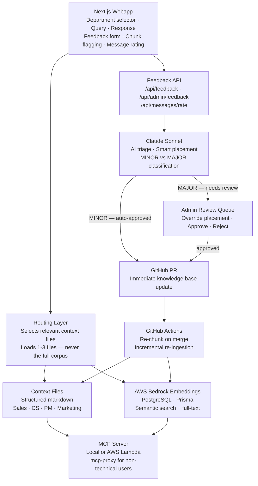
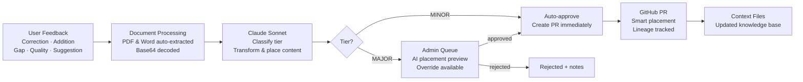

# Case Study: LiveData AI Context Engine

**Role:** Product Manager (spec + build)
**Stack:** TypeScript, Next.js, PostgreSQL, AWS Bedrock Embeddings, MCP, Prisma
**Status:** Live — widely adopted across the organization

> This is a case study. No proprietary source code, customer data, or internal content is included. See `NOTICE.md`.

---

## The Problem

LiveData serves 90+ hospitals with a complex product suite spanning surgical scheduling, real-time OR coordination, analytics, and patient flow. The company has deep institutional knowledge — product details, pricing, customer personas, competitive positioning, clinical domain expertise, and operational KPIs — spread across documents, tribal knowledge, and individual heads.

For a lean team, that creates a constant tax: every new employee ramps slowly, every sales rep has to remember which battle card applies, every PM has to re-research domain benchmarks before writing a PRD. The knowledge existed. Getting to it was the problem.

The goal was to make that institutional knowledge instantly accessible to anyone in the org, in natural language, calibrated to their role.

---

## My Role

I designed and built the entire system. This is an internal product in active daily use across customer success, sales, marketing, and product.

---

## What I Built

### Department-Specific Engines
Rather than a single generic chatbot, the system is organized into purpose-built engines for each function:

| Engine | Primary Users | Optimized For |
|--------|--------------|---------------|
| **Sales Engine** | Account executives | Competitive positioning, objection handling, pricing, customer profiles |
| **CS Engine** | Customer success managers | Product deep-dives, implementation guidance, escalation context |
| **PM Engine** | Product managers | Domain benchmarks, feature context, roadmap alignment |
| **Marketing Engine** | Marketing | Brand voice, product messaging, content guidance |

Each engine loads only the context files relevant to its domain — a key cost and quality optimization.

### Smart Context Routing
The system doesn't load all company knowledge for every query. A routing layer determines which context files are needed based on the question, and loads only those. A query about Insights pricing loads product files. A query about VA hospital KPIs loads the domain and company files. This keeps responses fast, focused, and cheap.

### Structured Knowledge Base
The underlying knowledge is maintained as structured markdown files covering:
- Company strategy, priorities, and FY targets
- Full product suite (features, pricing, integrations, architecture)
- Customer segments (VA vs. commercial, personas, pain points, buying patterns)
- Competitive landscape and battlecards
- Clinical domain knowledge (OR metrics, benchmarks, surgical workflow)

### Webapp
A Next.js interface for employees to interact with the engine, with role-appropriate views and query history.

### MCP Server — Two Deployment Modes
The MCP server is available in two forms depending on the user:

- **Local server** — for developers using Claude Code, runs directly from the repo
- **AWS Lambda + API Gateway** — serverless deployment for non-technical users; ~$0.50/month at typical usage, zero client-side updates when the knowledge base changes

For non-technical users, a lightweight client proxy (`mcp-proxy`) handles the connection. It installs via `npm install -g` or a Windows batch installer, adds a single config entry to Claude Desktop, and requires no local database or git access. Users get access to the full engine without touching the codebase.

### Automated Ingestion Pipeline & CI/CD
The knowledge base stays current automatically. Three GitHub Actions workflows handle the full lifecycle:

- **Re-chunk on merge** — when any context file changes, a workflow runs AWS CodeBuild to re-chunk and re-embed only the changed files (incremental mode), then posts a success/failure comment to the PR
- **Manual pipeline trigger** — full re-ingestion with optional GitHub repo sync, monitoring build status for up to 30 minutes
- **App Runner deploy** — on push to main, builds a Docker image, pushes to ECR, and deploys to AWS App Runner

The ingestion pipeline itself handles: GitHub repo sync, semantic markdown chunking, PostgreSQL full-text search indexing, and AWS Bedrock embedding generation. Adding a new knowledge source is a config file change.

### Template System
Structured document generation for common outputs — briefing documents, competitive summaries, onboarding materials. Templates use intent detection (keyword and regex matching) to trigger automatically based on what the user is asking for. Each template is role-scoped, versioned, and tracks usage analytics including which context chunks were used and quality ratings.

### Feedback & Knowledge Maintenance System
A self-improving loop that closes the gap between what the engine answers and what the knowledge base contains. Users flag problems directly from the chat interface; AI triages and routes changes into the knowledge base via GitHub PRs.

**Two feedback entry points:**
- **Response-level feedback** — users submit corrections, additions, gaps, or quality issues via a structured form, with optional file attachments (PDFs and Word docs are auto-extracted)
- **Chunk-level feedback** — users flag specific retrieved sources as wrong, outdated, or irrelevant directly from the response, linked to the exact chunk that caused the problem

**AI-powered triage (Claude Sonnet):**

| Tier | What triggers it | What happens |
|------|-----------------|--------------|
| **MINOR** | Typos, formatting, small clarifications | Auto-approved → GitHub PR created immediately |
| **MAJOR** | New facts, pricing changes, strategy, competitive intel | Enters admin review queue |

**Smart placement:**
For every approved change, Claude analyzes the target file's existing structure — headings, sections, and surrounding content — and recommends exactly where to insert the new content. Admins can override the suggestion before approving. The resulting PR includes the placement reasoning.

**Lineage tracking:**
Every chunk created from a feedback submission stores a `createdFrom` reference back to the originating feedback item. Stale chunks (not reviewed in 6+ months) are flagged automatically.

**Message rating:**
Lightweight thumbs-up/down on any response provides a quick quality signal without requiring the full feedback form.

---

## Architecture

### Feedback Triage Flow

---

## Key Design Decisions

**1. Smart context loading over full-corpus RAG**
The most common RAG failure mode is dumping too much context and getting diluted, unfocused answers. This system uses explicit routing rules — based on query type — to load only the relevant files. The result is faster, more precise responses at lower cost.

**2. Department engines instead of one generic assistant**
A sales rep asking about competitive positioning needs different framing than a PM asking the same question. Separate engines with separate system prompts and context priorities meant the tool was useful on day one, not after weeks of prompt tuning.

**3. Structured markdown as the knowledge layer**
Rather than ingesting unstructured documents and hoping embeddings catch everything, the knowledge base is actively maintained as clean, structured files. This makes answers more reliable and makes knowledge updates intentional rather than accidental.

**4. MCP integration for composability**
Building an MCP server meant the context engine could become a tool other internal AI systems call — Claude Code sessions, custom agents, future products — without duplicating the knowledge or the retrieval logic.

**6. Two-tier MCP deployment for different audiences**
Developers get a local MCP server that runs from the repo. Non-technical users — sales reps, CSMs, marketers — get the Lambda deployment via a lightweight proxy they install once. Same knowledge base, same tools, zero friction for the people who need it most.

**5. Feedback as a product feature, not an afterthought**
Most internal tools have no feedback loop — knowledge gets stale and no one knows. Building a structured feedback system with AI triage and GitHub PR creation turned the knowledge base into a living document. The MINOR/MAJOR split was a deliberate design choice: auto-approving small corrections removes friction for users while keeping human review on anything that could materially change how the engine responds.

---

## Outcomes

- Widely adopted across customer success, sales, marketing, and product teams
- Reduced ramp time for new employees by giving instant access to institutional knowledge
- Sales reps can access competitive positioning and objection handling without searching through decks
- PMs can pull domain benchmarks and product context directly into their workflow
- Foundation that other internal AI tools now build on via MCP
- Feedback loop keeps the knowledge base current — users flag stale or incorrect answers directly from chat, AI triages and routes changes into PRs automatically
